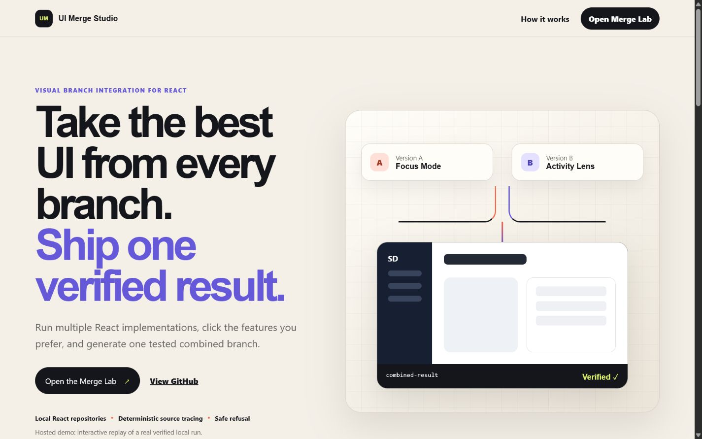

# UI Merge Studio

## Real-artifact Showcase

The hosted Showcase is an interactive replay of verified controlled run `3788f05dfefcd572`. Its recruiter-facing landing page explains the product without mounting an application, then the Merge Lab lets a visitor switch among one large active baseline/branch preview, select **Focus Mode** and **Activity Lens** through authoritative parent controls, inspect generated source and dependency evidence, and reveal the actual prebuilt candidate at `ede2b13e9b5016b1abcabfd4996ece6d52ed138c`.

`npm run showcase:prepare` validates the fixture, analyzes both selected React boundaries, invokes the existing candidate generator, runs its verification gates, builds baseline/Branch A/Branch B/the generated candidate, exports those builds, sanitizes the evidence, and generates the frontend manifest. `npm run build` validates the report, manifest, artifact presence, and SHA-256 hashes before building Studio.

Vercel only deploys those static outputs. It does not run Git, create worktrees, generate a branch, or execute tests. Use local mode for live repository operations.

UI Merge Studio compares running React branches, traces selected UI boundaries to source and dependencies, and creates a verified candidate from the exact shared base.

Public evidence: [Source code](https://github.com/varun-raj-77/ui-merge-studio) · [Architecture](docs/adr/) · [Evaluation evidence](docs/evaluation.md) · [Local setup](#run-the-controlled-demo) · [Limitations](docs/limitations.md) · [Development history](docs/codex-prompts/)

The hosted Showcase is an interactive replay of committed controlled-run evidence. It does not run Git, create branches, execute tests, or mutate a repository in the visitor's browser. Those operations remain in local engine mode.

`docs/codex-prompts/` is development history: structured implementation briefs, acceptance criteria, test requirements, completion-report contracts, and scope-control records. It documents the engineering process; it is not runtime product evidence and is not used as a primary Showcase link.

**Visually select preferred features from multiple running React branches and create one verified combined branch.**

UI Merge Studio is an open-source local developer tool for comparing multiple React and TypeScript Git branches as live applications. Developers can select preferred rendered UI regions, trace those selections to React source and supporting dependencies, generate a deterministic candidate branch, and verify the result with typechecks, tests, builds, and runtime checks.

> Current scope: local React + TypeScript + Vite repositories using npm, pnpm, or yarn.

## Showcase Mode

Showcase Mode is the static, Vercel-ready first-run experience for people who do not have a compatible repository locally. It presents the controlled sample's base branch, navigation experiment, activity-filter experiment, and combined result as actual compiled React applications.

The two-layer experience teaches `Visible selection → Source evidence → Dependencies → Candidate result → Verification or safe refusal` without setup. The Lab mounts exactly one active artifact at a time. Parent-page controls select the two visible feature boundaries; the composition tray remains locked until both are selected. The final view exposes the compiled candidate, four developer-facing verification checks backed by the five-gate report, and developer handoff links.

Lab state is stored in `history.state` at `?mode=showcase&view=lab`, so valid selections survive version switching, browser back/forward, and refresh. **Restart Lab** replaces that state with a clean Lab. No selection state is written to cookies, `localStorage`, `sessionStorage`, or a server.

The walkthrough is deliberately an evidence replay, not cloud execution: its progress labels and verification summary present the committed controlled proof. The browser does not create Git worktrees, mutate a repository, or rerun tests. Use local mode to execute the real engine.

```sh
# Hosted-style showcase during development
npm run dev
# open http://127.0.0.1:4310/?mode=showcase

# Production builds default to Showcase Mode
npm run build
```

Add `?mode=local` to a production-served build only when it is paired with the Node server and local repository APIs.



## Why it exists

Git understands files and commits, but it does not understand statements such as:

> “Use the navigation from this branch and the activity filters from that branch.”

UI Merge Studio translates a visual preference expressed through a running interface into a constrained source integration:

```text
visual selection
→ runtime React identity
→ source declaration
→ Git diff from common base
→ dependency slice
→ candidate plan
→ deterministic transformation
→ verification
→ live combined result
```

AI is not the merge authority. Git evidence, runtime source metadata, AST analysis, dependency tracing, and verification determine what can be included.

## What has been proven

### Controlled Phase 0

The controlled React/TypeScript/Vite repository demonstrates:

- isolated branch execution through Git worktrees;
- side-by-side live previews;
- rendered UI selection;
- runtime React element-to-source mapping;
- dependency-aware source slicing;
- required imports, types, hooks, styles, assets, and tests;
- exclusion of unrelated branch changes;
- deterministic and idempotent candidate generation;
- TypeScript, test, build, and runtime verification;
- a working combined result;
- evidence-backed refusal of an intentionally unsafe combination.

### External Vite validation

UI Merge Studio was also tested against an unrelated open-source React/TypeScript/Vite application.

Proven externally:

- two feature branches launched in separate worktrees and processes;
- rendered UI regions were selected through the Studio;
- generic runtime instrumentation mapped those regions to source;
- Git/AST analysis included direct and transitive static dependencies;
- unrelated visible branch edits were excluded;
- a six-file candidate was generated directly from the exact common base;
- install, TypeScript, lint, production build, and combined runtime verification passed;
- repeated generation recognized the exact candidate tree as idempotent;
- a competing edit to the same declaration was refused before mutation;
- no repository-specific component names drove the mapping;
- source branches remained unchanged;
- preview processes and temporary worktrees were cleaned up.

Observed mappings:

```text
PageContent
→ src/components/layout/contentbar.tsx:26:7

RevenueTrendChart
→ src/views/dashboard/index.tsx:27:7
```

The verified external candidate is one commit directly above base `8223897` and has deterministic tree `1d0165457f9471908539f6660f17574b1f89dfe8`. This is evidence for one unrelated Vite repository, not universal Vite or React support.

## Product workflow

1. Choose two compatible local feature branches.
2. Launch them as isolated interactive applications.
3. Compare them side by side.
4. Select preferred rendered features.
5. Inspect source and dependency evidence.
6. Plan the integration before mutation.
7. Create a candidate branch from the exact common base.
8. Run verification gates.
9. Open the combined application.
10. Refuse unsupported or unsafe combinations.

## Architecture

UI Merge Studio currently uses:

- Git merge-base analysis;
- isolated Git worktrees;
- managed Vite processes and ports;
- development-only React source instrumentation;
- DOM and React element-to-source mapping;
- TypeScript and TSX AST analysis;
- declaration and dependency slicing;
- import reconciliation;
- deterministic candidate planning;
- candidate branch generation;
- Playwright runtime verification;
- cleanup and rollback.

Every generated source change must trace to either:

- a selected rendered feature; or
- a required dependency of that feature.

## Requirements

- Node.js 20 or newer
- Git
- npm
- Chromium for Playwright

Install Playwright Chromium with:

```sh
npx playwright install chromium
```

## Run the controlled demo

```sh
npm ci
npm run dev
```

Open:

```text
http://127.0.0.1:4310
```

Choose **Try sample demo**.

The controlled sample compares:

- a collapsible navigation feature;
- activity-filter controls.

The final workflow creates and verifies `combined-result`.

## Verification commands

```sh
npm run typecheck
npm test
npm run test:studio
npm run test:instrumentation
npm run test:preview-runtime
npm run test:multi-preview
npm run test:source-analysis
npm run test:feature-slice
npm run test:test-slicing
npm run test:candidate-generation
npm run test:candidate-integration
npm run test:e2e
npm run fixture:verify
npm run build
```

The Prompt 008 regression run reported 90 passing Studio tests, successful typechecking, a successful production build, and successful fixture verification.

The Prompt 008 external validation reported three focused integration tests and one successful six-minute Playwright journey. The external repository has no application test script, so no external unit-test result is claimed.

## Generated data

The controlled fixture is generated under:

```text
fixtures/generated/support-dashboard
```

Runtime analysis and generation reports are written under:

```text
.ums/
```

These directories are ignored by Git.

Generation refuses to overwrite a dirty controlled fixture. Recreate it only when generated work is disposable:

```sh
npm run fixture:create -- --recreate
```

## Current limitations

UI Merge Studio does not currently claim support for:

- Next.js;
- arbitrary React repositories;
- arbitrary monorepos;
- cloud code execution;
- GitHub-hosted repository execution;
- mobile applications;
- backend-service merging;
- collaboration or billing;
- guaranteed integration of every branch combination.

FlowCraft was evaluated as a validation target but uses Next.js 14 App Router, outside the current Vite-only scope. No FlowCraft integration is claimed.

Candidate generation has been demonstrated on the controlled repository and one unrelated Vite repository. The external proof uses conventional relative static imports and a small dependency graph; broader repository and dependency patterns remain unproven.

Correct refusal is considered a product capability.

## Deployment boundary

The real execution engine is local because it requires:

- local repository access;
- Git worktree creation;
- package installation;
- process and port management;
- source-file mutation;
- tests and production builds;
- branch creation.

A public hosted version should therefore be presented as an interactive showcase or recorded walkthrough, not as cloud execution of a visitor’s repository.

## Project status

| Capability | Status |
|---|---|
| Controlled multi-branch execution | Passed |
| Controlled rendered UI selection | Passed |
| Controlled source mapping | Passed |
| Controlled dependency slicing | Passed |
| Controlled candidate generation | Passed |
| Controlled unrelated-change exclusion | Passed |
| Controlled verification | Passed |
| Controlled unsafe-combination refusal | Passed |
| External Vite execution | Passed |
| External Vite source mapping | Passed |
| External Vite candidate generation | Passed (bounded) |
| Next.js support | Unsupported |
| Cloud execution | Unsupported |

## Roadmap

The next compatibility milestone should test a second unrelated Vite repository with an application-owned test suite and meaningfully different source structure. Next.js requires an explicit framework adapter and remains unsupported; the current evidence must not be generalized into universal React support.

## License

MIT
