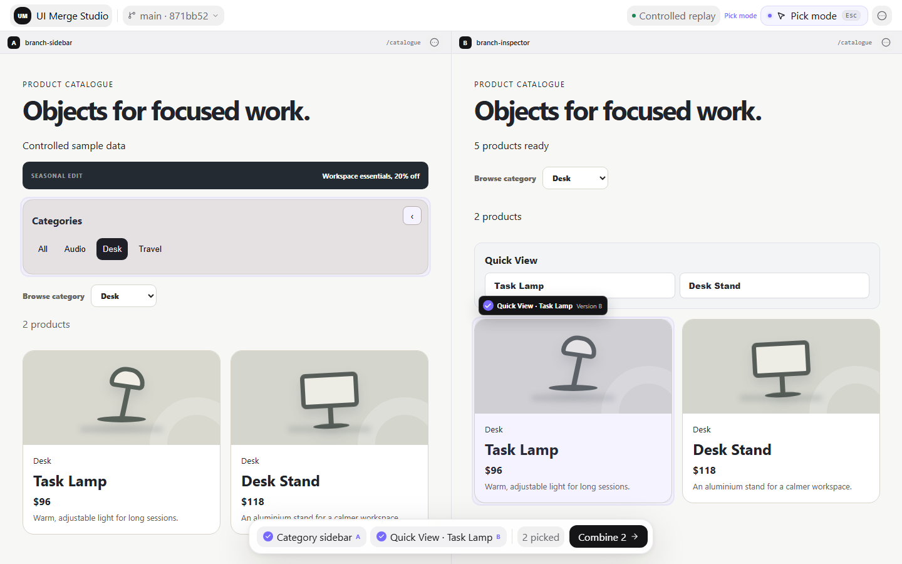
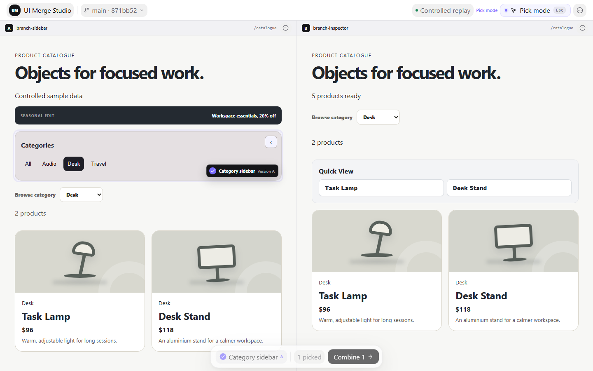
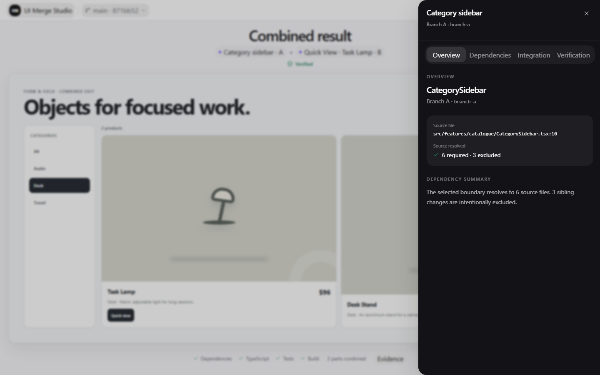
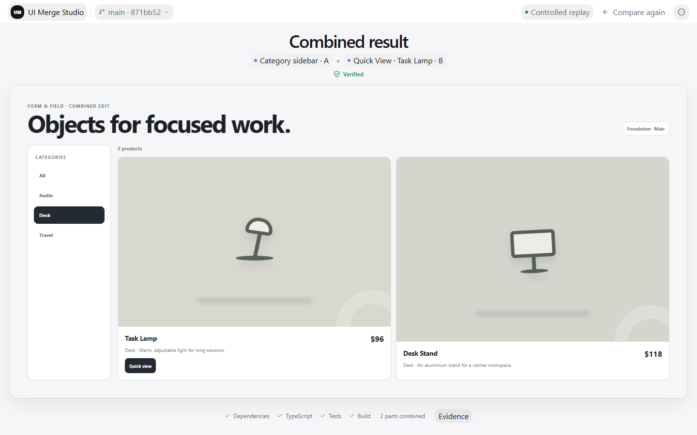
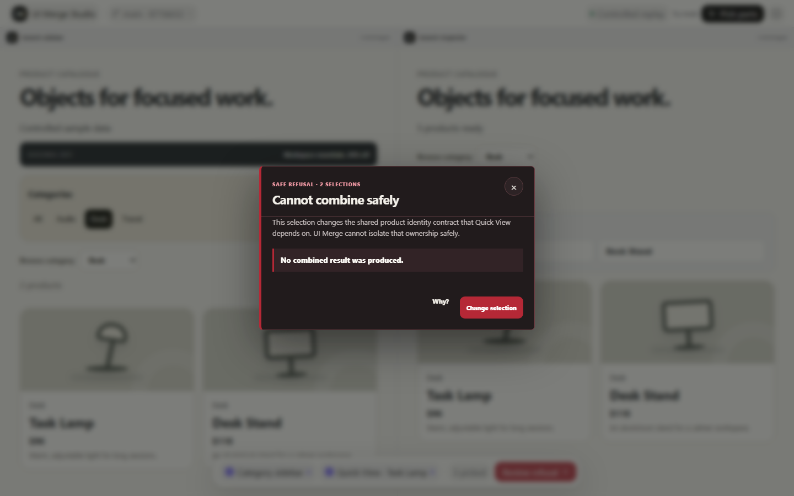
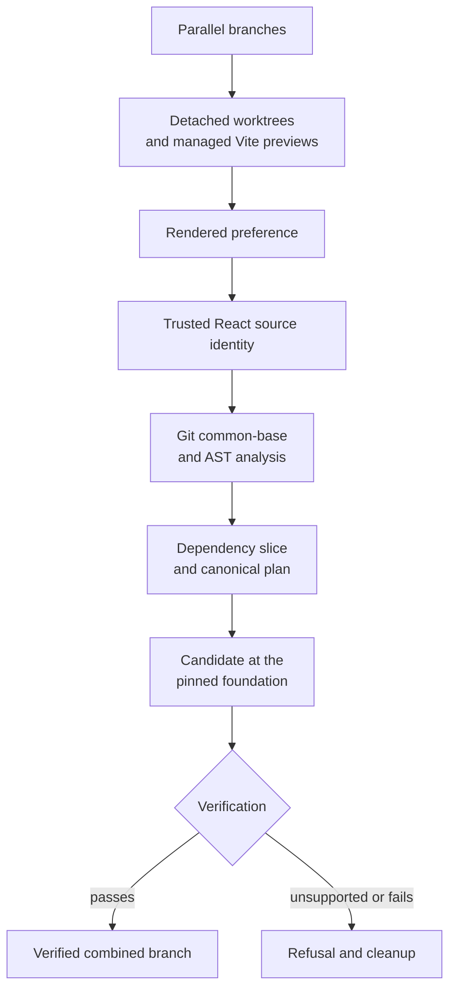
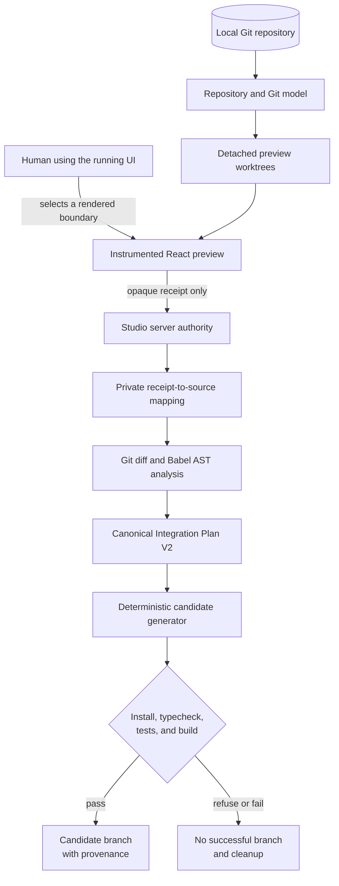

<h1 align="center">UI Merge Studio</h1>

<p align="center"><strong>Visual decision and integration for parallel React implementations</strong></p>

<p align="center">
  Compare running branches. Pick the implementation decisions you want.<br />
  Create one verified combined branch.
</p>

<p align="center">
  <a href="https://ui-merge-studio.vercel.app/"></a>
  
  
  
  
  <a href="LICENSE"></a>
</p>

<p align="center">
  <a href="https://ui-merge-studio.vercel.app/"><strong>Explore the interactive Showcase</strong></a>
</p>

<p align="center">
  
</p>

<p align="center"><sub>Two running implementations, two rendered decisions, one composition ready for verification.</sub></p>

## Overview

**Visually select preferred features from multiple running React branches and create one verified combined branch.**

For supported combinations, UI Merge Studio turns that visual decision into a bounded React + TypeScript + Vite integration workflow. It runs parallel branches in isolated Git worktrees and lets a human express preference through the rendered product.

Each selected React boundary is traced to source and dependencies, recorded in a deterministic integration plan, and verified before a combined branch is registered.

Rendered UI is the decision surface—not the material being copied. The candidate is produced from source, Git history, dependency evidence, and explicit verification.

## Interactive Showcase

[Open the Iris Showcase](https://ui-merge-studio.vercel.app/) to compare the controlled branches, try their behavior, pick supported regions, inspect source evidence, view a verified result, and review a safe refusal.

> **Hosted vs. local:** The hosted Showcase explores a committed, validated controlled run. Real Git/worktree execution, source analysis, candidate generation, and branch creation run locally.

## Why UI Merge Studio

Parallel implementations are often evaluated in product language: “Keep the navigation from this implementation and the filtering behavior from that one.” Git accurately records source history, while people often decide which implementation is preferable by using the running software.

UI Merge Studio connects those two views:

1. compare the applications as applications;
2. capture a preference at a rendered React boundary;
3. resolve that boundary to trusted source identity;
4. include the dependencies it actually needs;
5. exclude separable sibling changes;
6. produce a verified branch—or refuse the operation.

### Why not just ask an agent to merge the branches?

An agent can be useful for interpreting ambiguity or helping with a manual repair. UI Merge Studio makes a different architectural choice: human preference is captured from rendered software, while source identity, provenance, dependencies, bounded writes, and verification remain explicit.

AI is not the deterministic merge authority, and this workflow is not claimed to be better for every integration task. Unsupported combinations can be refused.

## Product Walkthrough

### Compare running implementations

Version A and Version B run side by side with stable identities, synchronized product context, and fixed preview surfaces. The hero above shows the controlled catalogue branches after both decisions have been picked.

### Pick implementation decisions

Pick mode reveals supported React boundaries. A selected region stays visible in its branch, while the Selection Island records the decision independently of incidental browser state.



### Trace preferences to source

Evidence connects the visible decision to its component, source location, required files, excluded sibling changes, integration operation, and verification record.



### Create and verify the result

The combined view identifies both inputs and shows the checks attached to the result. In local engine mode, this stage is backed by a generated candidate worktree and branch rather than a browser-only composition.



### Refuse unsupported combinations

When selected slices depend on incompatible versions of a shared contract, preflight stops before candidate mutation and explains what must be reconciled manually.



## How It Works



The browser expresses a decision. It does not get to author source paths, dependency lists, or generation artifacts. Those are resolved and validated by the local server against the active preview sessions and pinned Git commits.

## What Has Been Proven

### Controlled proof

The Product Catalogue fixture demonstrates the full causal path:

- isolated branch previews from detached worktrees;
- rendered Category Sidebar and Quick View selections;
- opaque current-session selection receipts resolved to server-owned source identity;
- Git/Babel AST dependency slicing, including focused tests and integration edges;
- exclusion of the promotional banner and inventory-summary changes;
- candidate generation from the exact pinned foundation/common ancestor;
- install, TypeScript, focused-test, production-build, and runtime evidence;
- deterministic replay and candidate provenance;
- refusal for the incompatible numeric-versus-string `Product.id` contract.

The committed Showcase contains **64 controlled candidate states validated across dependency setup, TypeScript, tests, and production builds**. Playwright journeys separately verify the featured runtime behavior and refusal. The Sidebar + Task Lamp candidate is commit `bc4d2985bf198b87d76009073a754c401debd71e`.

These are fixture results, not general performance or compatibility benchmarks. See the [machine-readable run report](docs/evidence/showcase/latest/run-report.json).

### Unrelated React/Vite validation

One pinned, unrelated React + TypeScript + Vite repository has demonstrated managed preview execution, rendered source mapping, dependency slicing, candidate generation, unrelated-change exclusion, runtime checks, and deterministic replay. The corrected direct-child projection produced tree `ecc68ab021158f978aa184640605f9a7b21d5949`: both selected features and their required dependencies are present; the co-located density control and separate footer edit are absent.

That repository has no application-owned test script. The exact external scenario last passed in the recorded safe-projection run; a fresh rerun after the later controlled-fixture alignment remains outstanding. **Evidence from one unrelated repository is not universal framework support.** The failure that motivated the safer projection and the corrected evidence are preserved in [Engineering evaluation](docs/evaluation.md).

## Architecture



- **Repository discovery** confirms a local Git root and detects React, TypeScript, Vite, entry points, scripts, and package-manager evidence.
- **Git isolation** resolves merge bases and pinned commits, prepares detached worktrees, checks cleanliness, and removes owned worktrees.
- **Managed preview runtime** installs dependencies, launches Vite on a strict loopback port, instruments project-owned React source, and supervises processes.
- **Selection authority** privately maps random receipts to source for an exact preview session. Normal requests carry the receipt, not browser-authored source metadata.
- **Source analysis** combines Git hunks with Babel-parsed TypeScript/TSX declarations, imports, render edges, styles, assets, and conventional tests.
- **Integration planning** canonicalizes the pinned foundation and ordered decisions into a stable Integration Plan V2 identity.
- **Candidate generation** revalidates evidence, computes deterministic AST operations, writes only planned paths, and records operation provenance.
- **Verification and refusal** registers a branch only after configured checks pass, recognizes identical replay, and refuses stale, conflicting, ambiguous, or unsupported work.

Deeper decisions are documented in the [architecture decision records](docs/adr/), including [source instrumentation](docs/adr/0002-build-time-react-source-instrumentation.md), [feature slicing](docs/adr/0004-ast-and-git-evidence-feature-slicing.md), [candidate generation](docs/adr/0006-deterministic-ast-candidate-generation.md), and [foundation semantics](docs/adr/0015-foundation-branch-semantics.md).

## Engineering Challenges

- **Mapping a rendered decision to trusted source.** A Vite transform instruments project-owned React boundaries and privately registers source mappings for the active preview session.
- **Keeping browser input from becoming source authority.** The public analysis request accepts one opaque receipt; the server resolves source identity and rejects browser-supplied metadata.
- **Finding the dependency slice.** Git changes and AST edges are traversed across declarations, imports, render integration, styles, assets, types, and focused tests.
- **Generating from the exact common base.** Foundation and source refs are pinned to commits and revalidated against their common ancestor before mutation.
- **Preserving provenance and idempotency.** Stable identities, source hashes, operation pre/postconditions, and candidate metadata make replay inspectable.
- **Verifying behavior, not only text.** Candidate gates cover installation, TypeScript, tests, and production builds; relevant journeys also launch the runtime preview.
- **Refusing unsupported combinations.** Ambiguous ownership, stale evidence, incompatible contracts, failed projection, or failed verification produces no successful candidate branch.

## Technology Stack

| Area | Technology |
| --- | --- |
| Studio UI | React 19, TypeScript 5.8, Vite 6 |
| Presentation | Tailwind CSS v4, Motion, focused Radix UI primitives, Lucide icons |
| Git isolation | Git worktrees, merge-base analysis, pinned refs and trees |
| Runtime and process control | Node.js 20+, managed child processes, strict loopback ports |
| Source instrumentation | Vite transforms, Babel parser/traverse/generator, React boundary metadata |
| Analysis and generation | Git diffs, Babel AST analysis for TypeScript/TSX, content hashing, deterministic operation plans |
| Verification | Vitest, Testing Library, Playwright, TypeScript, Vite production builds |

## Testing and Verification

Coverage is organized around product and safety boundaries rather than one headline test count:

- Studio interaction, selection history, configuration, and evidence UX;
- repository discovery, dirty-tree refusal, worktree isolation, and cleanup;
- preview command resolution, Vite instrumentation, and process lifecycle;
- receipt authority, source identity, dependency and test slicing;
- candidate planning, AST projection, provenance, idempotency, and refusal;
- Playwright journeys across controlled and bounded external repositories;
- controlled-fixture parity and tracked Showcase-manifest validation.

The current README cites 64 controlled candidate states validated across dependency setup, TypeScript, tests, and production builds instead of reusing a historical aggregate test count.

<details>
<summary>Validation commands</summary>

```sh
npm run typecheck
npm test
npm run fixture:verify
npm run test:e2e
npm run showcase:validate
npm run build
```

The opt-in external regression uses a disposable pinned checkout:

```sh
npm run external:prepare
npm run test:e2e:external
```

It requires network access during preparation and is intentionally separate from the default suite.

</details>

## Run Locally

### Prerequisites

- Node.js 20 or newer
- Git
- npm

### Run the controlled local engine

```sh
git clone https://github.com/varun-raj-77/ui-merge-studio.git
cd ui-merge-studio
npm ci
npm run fixture:create
npm run dev
```

`fixture:create` is a one-time clean-clone step. It creates the ignored controlled Git repository used by local engine mode.

Open the local engine at:

```text
http://127.0.0.1:4310/?mode=local
```

The same development server exposes the committed Showcase at:

```text
http://127.0.0.1:4310/?mode=showcase
```

### Inspect another local repository

Pass the repository root before Studio starts preview work:

```sh
npm run dev -- --repository /absolute/path/to/react-vite-repository
```

The path must be the clean root of a local Git repository that passes the current React + TypeScript + Vite discovery checks and declares a `dev` script. `UI_MERGE_REPOSITORY_PATH` is also available for scripted startup.

Install Playwright's browser only when running browser tests:

```sh
npx playwright install chromium
```

## Repository and Generated Data Notes

| Path | Policy |
| --- | --- |
| `apps/studio/public/showcase/` | Tracked, validated static branch/candidate artifacts used by the hosted Showcase. |
| `docs/evidence/showcase/latest/` | Tracked sanitized run report and representative candidate image. |
| `fixtures/generated/` | Ignored local fixture repository created by `npm run fixture:create`. |
| `.preview-worktrees/`, `.validation-worktrees/`, `.ums/` | Ignored local execution, external-validation, and generation evidence. |
| `test-results/`, `playwright-report/` | Ignored browser-test output; selected approved frames are promoted to `docs/images/`. |

Historical evaluation material remains available in [development prompts](docs/codex-prompts/), [evaluation](docs/evaluation.md), [limitations](docs/limitations.md), and the [risk register](docs/risk-register.md). The main README describes the current product rather than replaying the project chronology.

## Current Limitations

- Local execution targets a clean, root-level React + TypeScript + Vite Git repository with a declared `dev` script. Next.js, arbitrary monorepos, server components, and cloud repository execution are not supported.
- npm command resolution, real installation, preview launch, and default candidate verification are covered. pnpm/yarn command and argument resolution exist, but their real install/launch paths are not verified; default candidate verification remains npm-specific.
- Dependency installs run ordinary repository code inside detached worktrees. They may use the network, mutate that worktree, and execute lifecycle scripts; this is isolation from the original checkout, not a sandbox or immutable install.
- Normal local generation accepts one or two current-session analyzed feature decisions. It is not arbitrary branch merging or full semantic reconciliation.
- Safe region projection is deliberately narrow: a uniquely identified added JSX component must be a direct child of a structurally compatible parent with a unique unchanged anchor, or an empty parent. Ambiguous and expression-enclosed shapes are refused.
- Dynamic imports, path aliases, factories, render props, class components, portals, CSS-in-JS, mixed ownership, and unconventional tests may be partial or unsupported. External global CSS ownership is refused; assets require exclusive static dependency evidence.
- The local developer, browser, and processes are trusted. Opaque receipts prevent browser-authored source metadata from becoming normal-flow generation authority, but they are not tamper-proof evidence of a physical click.
- The hosted configured result renders canonical-plan projections; it does not check out Git, create a branch, or prove an unrecorded local integration.
- There is no GitHub authentication, push, pull-request, collaboration, or production-readiness claim.

Correct refusal is a product capability, not a hidden failure. The full constraint set is maintained in [Current limitations](docs/limitations.md).

## Current Evaluation Focus

- rerun the exact bounded external Vite regression against the latest evaluation state;
- validate a second unrelated Vite repository that owns meaningful application tests;
- expand syntax, route, and package-manager coverage only where new evidence supports it.

These are evaluation targets, not shipped capability claims.

## What UI Merge Studio Demonstrates

- React runtime instrumentation tied to source identity;
- Git internals and isolated process/worktree lifecycle management;
- AST- and dependency-aware TypeScript/TSX transformation;
- canonical intent, deterministic provenance, and idempotent replay;
- developer-tool UX that moves from visual choice to inspectable evidence;
- refusal as a designed outcome;
- end-to-end verification before branch registration.

## License

[MIT](LICENSE)

## Explore

Try the [interactive Showcase](https://ui-merge-studio.vercel.app/), inspect the [recorded evidence](docs/evidence/showcase/latest/run-report.json), or run the controlled engine locally to follow one rendered decision all the way to a verified candidate branch.
